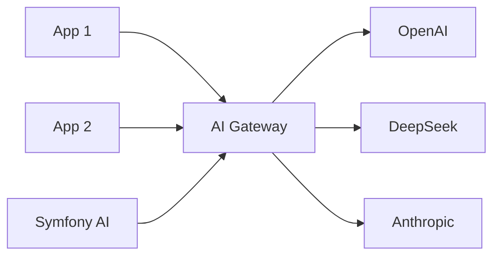
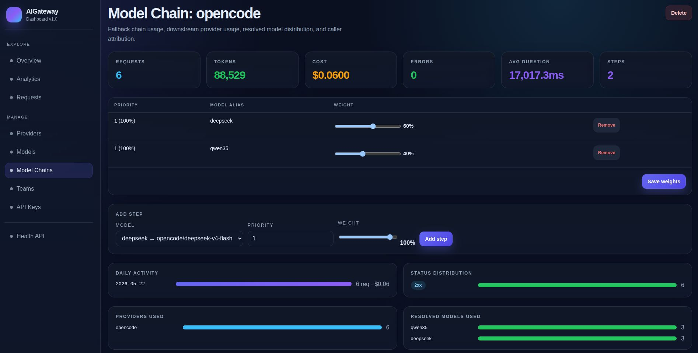
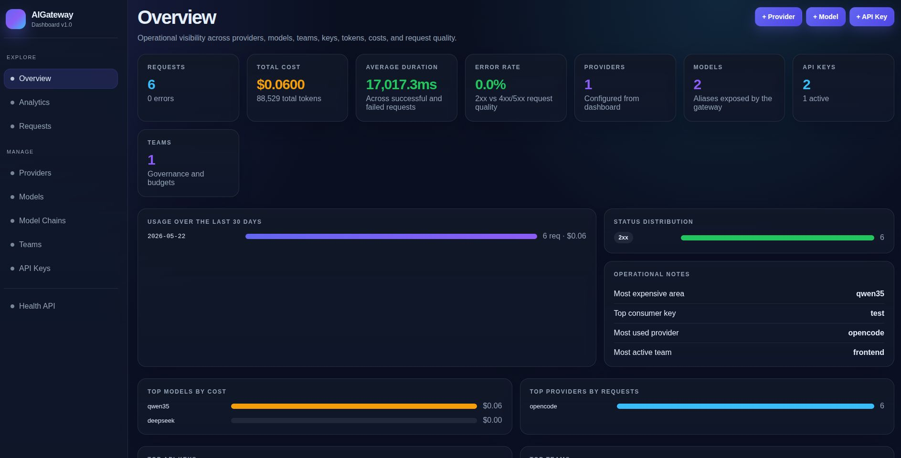
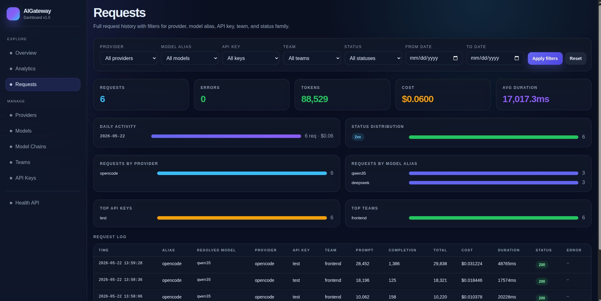

# AI Gateway

**Authenticate, log, and centralize AI model access — without adding another SDK to your project.**

AI Gateway is a transparent HTTP proxy for LLM APIs. It sits between your apps and AI providers and does exactly three things:

1. **Authenticates** — each request is authorized via API key
2. **Logs** — every request is tracked with tokens, costs, and duration
3. **Centralizes model config** — clients use aliases (`deepseek`, `claude-sonnet`), the gateway resolves the real model name and provider API key

Everything else passes through **unchanged**. The request body, tools, streaming, response format — it all goes through as raw JSON. The gateway only swaps the `model` field and the `Authorization` header.

> Package: [`ai-gateway/ai-gateway-bundle`](https://packagist.org/packages/ai-gateway/ai-gateway-bundle)

---

## Table of contents

- [Why](#why)
- [Quick start](#quick-start)
- [Bundle vs standalone](#bundle-vs-standalone)
- [How it works](#how-it-works)
- [Demo: use it from Symfony AI](#demo-use-it-from-symfony-ai)
- [Configuration](#configuration)
- [Providers](#providers)
- [Models](#models)
- [Chains](#chains)
- [Dashboard](#dashboard)
- [Extending auth (bundle mode)](#extending-auth-bundle-mode)
- [HTTP API](#http-api)
- [Deploy](#deploy)

---

## Why

Every team that uses LLMs ends up rebuilding the same plumbing:

- sharing API keys across projects
- tracking who uses what
- avoiding provider SDK lock-in
- changing models without updating every client

AI Gateway solves this as **infrastructure** — one service that all your apps talk to via the standard OpenAI-compatible API. Your apps don't import a gateway SDK; they just point their existing HTTP client at the gateway URL.



---

## Quick start

### Option 1: Docker pull (no clone needed)

```bash
docker pull ghcr.io/symfony-ai-gateway/ai-gateway-bundle:latest
docker run -d -p 8080:80 \
  -e DASHBOARD_TOKEN=replace-me-dashboard-token \
  ghcr.io/symfony-ai-gateway/ai-gateway-bundle:latest
```

Open the dashboard (the token will be requested on first visit):

```
http://localhost:8080/dashboard
```

Then:

1. **Add a provider** — e.g. DeepSeek with your API key
2. **Create a model** — alias `deepseek` → model `deepseek-v4-flash`
3. **Create an API key** — you'll get something like `aigw_xxx...`
4. **Call the API**:

```bash
curl http://localhost:8080/openai/v1/chat/completions \
  -H "Authorization: Bearer aigw_xxx" \
  -H "Content-Type: application/json" \
  -d '{"model":"deepseek","messages":[{"role":"user","content":"Hello!"}]}'
```

### Option 2: Docker Compose (from clone)

```bash
git clone https://github.com/symfony-ai-gateway/ai-gateway-bundle.git
cd ai-gateway-bundle
docker compose up -d
```

Environment variables (optional):

| Variable | Default | Description |
|---|---|---|
| `DASHBOARD_TOKEN` | `replace-me-dashboard-token` | Token to access the dashboard |
| `DATABASE_URL` | `sqlite:////runtime/data/auth.db` | Database connection (SQLite by default) |
| `APP_SECRET` | `changeMeInProduction` | Symfony app secret |

---

## Bundle vs standalone

The gateway can run in two modes. The difference is only where the Symfony app lives.

### Standalone — a service your whole team calls

The gateway runs in its own Docker container (FrankenPHP + SQLite). Every app in your organization calls it via HTTP — no matter the language or stack.

```
┌──────────────┐     ┌──────────────┐     ┌──────────┐
│  App A       │     │              │     │ OpenAI   │
│  (Symfony)   │────▶│              │────▶├──────────┤
├──────────────┤     │   Gateway    │     │ DeepSeek │
│  App B       │     │  (Docker)    │────▶├──────────┤
│  (Node.js)   │────▶│              │     │ Anthropic│
├──────────────┤     │              │     └──────────┘
│  Script C    │     └──────────────┘
│  (Python)    │────▶│
└──────────────┘
```

**Use this when:**

- You have apps in different languages (Symfony, Node.js, Python, Go...)
- You want a single place to manage all provider keys, budgets, and logs
- You change models and don't want to update every client
- Different teams own different apps — the gateway is the shared infrastructure

**How it works:** each app points its OpenAI-compatible HTTP client at `https://your-gateway:8080/openai/v1/chat/completions` with an `Authorization: Bearer aigw_xxx` header. No gateway SDK, no PHP dependency — just a URL swap.

```bash
docker compose up -d
```

### Bundle — embedded in your Symfony app

The gateway runs inside your existing Symfony app. Routes like `/openai/v1/chat/completions` are mounted directly into your application, sharing your existing Doctrine connection, auth system, and service container.

```
┌───────────────────────────────────────────┐
│            Your Symfony App               │
│                                           │
│  ┌─────────┐   ┌─────────────────┐        │     ┌──────────┐
│  │ Your     │   │   Gateway       │────────┼────▶│ OpenAI   │
│  │ code     │──▶│   (bundle)      │        │     ├──────────┤
│  │          │   │                 │────────┼────▶│ DeepSeek │
│  └─────────┘   └─────────────────┘        │     └──────────┘
│                                           │
│  DB, users, sessions, middleware...       │
└───────────────────────────────────────────┘
```

**Use this when:**

- You have one Symfony app and don't want to deploy a second service
- You want the gateway to share your app's existing auth — same users, same sessions
- You need the gateway to access your app's database (e.g. using your User entity for API key management)
- You're already on Symfony and prefer `composer require` over Docker

**How it works:** install the bundle, add 2 config files, and your app serves `/openai/v1/chat/completions` alongside your existing routes. Your own code can call the gateway internally or expose it externally.

```bash
composer require ai-gateway/ai-gateway-bundle
```

### Side-by-side

| | Standalone | Bundle |
|---|---|---|
| Deploy | `docker compose up -d` | `composer require` + 2 config files |
| Who can call it | Any app (any language) | Your Symfony app + external HTTP clients |
| Database | Own SQLite (separate) | Your app's Doctrine connection |
| Auth | Built-in API keys (`aigw_xxx`) | Built-in keys OR your app's users |
| Use case | Team-wide AI infrastructure | Single-app AI gateway |

### Recommendation

Start with **standalone** unless you're sure you only need it inside one Symfony app. The standalone is simpler to deploy, language-agnostic, and keeps your gateway config separate from your app code.

---

## How it works

### Two endpoints, transparent proxy

The gateway exposes two format-native endpoints. Each one does exactly the same thing: **authenticate using the format's auth header, resolve the model alias, swap the API key, and forward the raw request unchanged.**

```
┌──────────────┐
│              │     POST /openai/v1/chat/completions
│  OpenAI      │────▶  Authorization: Bearer aigw_xxx
│  client      │     ▶  {"model":"deepseek", "messages":[...], ...}
│              │
├──────────────┤
│              │     POST /anthropic/v1/messages
│  Anthropic   │────▶  x-api-key: aigw_xxx
│  client      │     ▶  {"model":"claude-sonnet", "messages":[...], ...}
│              │
└──────────────┘
         │
         ▼
    Gateway (auth + log)
         │
         ▼
    ┌────┴────┐
    ▼         ▼
  OpenAI   Anthropic
  provider provider
```

There is no format conversion. If you send an OpenAI-format request, the gateway forwards it as OpenAI to the resolved provider. If you send an Anthropic-format request, it forwards it as Anthropic. The only changes are:

1. `model` → resolved to the real provider model name
2. Auth header → replaced with the provider's real API key

### Transparent proxy

The gateway does **not** parse, transform, or reconstruct your request. It takes the raw JSON body, changes the model name and auth header, and forwards it.

**OpenAI request (POST /openai/v1/chat/completions):**
```
Incoming:  Authorization: Bearer aigw_xxx
           {"model":"deepseek", "messages":[...], "tools":[...]}
              ↓                    ↓
Outgoing:  Authorization: Bearer sk-real-key
           {"model":"deepseek-v4-flash", "messages":[...], "tools":[...]}
```

**Anthropic request (POST /anthropic/v1/messages):**
```
Incoming:  x-api-key: aigw_xxx
           {"model":"claude-sonnet", "max_tokens":1024, "messages":[...]}
              ↓                    ↓
Outgoing:  x-api-key: sk-ant-real-key
           {"model":"claude-sonnet-4-20250514", "max_tokens":1024, "messages":[...]}
```

Streaming (`stream: true`) works the same way — raw SSE bytes flow through transparently.

### What the gateway adds

| Layer | What it does |
|---|---|
| **Auth** | Validates `Authorization: Bearer aigw_xxx` before any request hits a provider |
| **Model resolution** | Turns `deepseek` into `deepseek-v4-flash` using dashboard config |
| **Endpoint routing** | OpenAI clients use `/openai/v1/chat/completions`, Anthropic clients use `/anthropic/v1/messages` |
| **API key swap** | Replaces the client's API key with the provider's real API key |
| **Logging** | Stores every request with model, tokens, duration, cost |
| **Budget & rate limits** | Enforces per-key and per-team limits |
| **Chains** | Fallback + weighted load balancing across multiple models |

### What the gateway does NOT do

- ❌ Provider SDK abstraction
- ❌ Request/response transformation (beyond model + key)
- ❌ Structured output / function call normalization
- ❌ Caching

---

## Demo: use it from Symfony AI

Because the gateway is OpenAI-compatible, you can point `symfony/ai-bundle` at it as a regular provider:

```yaml
# config/packages/ai.yaml
ai:
    llms:
        open_ai:
            my_gateway:
                apikey: '%env(AI_GATEWAY_KEY)%'
                base_url: 'http://localhost:8080/openai/v1'
                model: 'deepseek'
```

```php
use Symfony\AI\OpenAI\OpenAI;

$ai = new OpenAI(
    apiKey: $_ENV['AI_GATEWAY_KEY'],
    baseUrl: 'http://localhost:8080/openai/v1',
);

$response = $ai->chat('deepseek', [
    ['role' => 'user', 'content' => 'Hello from Symfony AI!'],
]);

echo $response->asText();
// → "Hello! How can I help you?"
```

The client sends `model: deepseek`, the gateway resolves it to `deepseek-v4-flash`, calls the provider, and returns the response. The Symfony AI code never knows a gateway is involved — it just calls an OpenAI-compatible endpoint.

The same works with any OpenAI-compatible SDK (Python, Node.js, Go, curl...).

---

## Configuration

Runtime configuration (providers, models, chains, keys, teams) is managed from the **dashboard** — no YAML editing needed day-to-day.

Bundle-level config (`config/packages/ai_gateway.yaml`) is only for dashboard access and route prefix:

```yaml
ai_gateway:
    dashboard:
        tokenRequired: true
        token: '%env(DASHBOARD_TOKEN)%'
    routes:
        enabled: true
        prefix: ''
```

---

## Providers

A provider is a backend AI API that the gateway forwards requests to. The format determines how the gateway authenticates to that provider:

| Format | Auth header | Default path | Provider examples |
|---|---|---|---|
| `openai` | `Authorization: Bearer` | `/chat/completions` | OpenAI, DeepSeek, OpenRouter, Groq, any OpenAI-compatible |
| `anthropic` | `x-api-key` + `anthropic-version` | `/v1/messages` | Anthropic Claude |

The provider format must match the endpoint format:

- use `/openai/v1/chat/completions` for models backed by `openai` providers
- use `/anthropic/v1/messages` for models backed by `anthropic` providers

If you call a model through the wrong endpoint, the gateway rejects the request instead of rewriting formats.

Add providers from the dashboard at `/dashboard/providers/new`.

---

## Models

A model is a local alias that maps to a real provider model:

| Alias | Provider | Real model | Pricing |
|---|---|---|---|
| `deepseek` | `opencode` | `deepseek-v4-flash` | $0.00 / $0.00 |
| `qwen` | `opencode` | `qwen3.5-plus` | $0.00 / $0.00 |

Clients always use the alias. You can change the underlying model without updating clients.

---

## Chains

A chain groups multiple models with fallback and weighted load balancing.

Example chain `opencode`:

| Step | Model | Priority | Weight |
|---|---|---|---|
| 1 | `deepseek` | 1 | 50 |
| 2 | `qwen` | 2 | 50 |

- Same priority → weighted random selection (50/50)
- Lower priority = fallback if higher fails



---

## Dashboard

| Path | Description |
|---|---|
| `/dashboard` | Overview |
| `/dashboard/providers` | Provider management |
| `/dashboard/models` | Model aliases |
| `/dashboard/chains` | Model chains |
| `/dashboard/keys` | API keys |
| `/dashboard/teams` | Teams & budgets |
| `/dashboard/requests` | Request logs |

Protected by `DASHBOARD_TOKEN` in query parameter or env.





---

## Extending auth (bundle mode)

In standalone mode, the gateway manages its own API keys (`aigw_xxx...`) via the dashboard. In bundle mode, you can replace this with your Symfony app's **existing user authentication** — no separate key management needed.

The gateway calls an `AuthEnforcer` before processing every request. By default it checks the built-in key store. You can register your own enforcer to authenticate from the session, from a custom header, or from your own user provider.

### Example: authenticate via Symfony session

```php
// src/Auth/SessionAuthEnforcer.php
namespace App\Auth;

use AIGateway\Auth\AuthEnforcer;
use AIGateway\Auth\ApiKeyContext;
use Symfony\Bundle\SecurityBundle\Security;

class SessionAuthEnforcer extends AuthEnforcer
{
    public function __construct(
        private Security $security,
    ) {}

    public function enforce(ApiKeyContext $context): void
    {
        $user = $this->security->getUser();
        if (!$user) {
            throw new \RuntimeException('Authentication required');
        }

        // Set budgets and model permissions based on user role
        $context->apiKey->setBudgetPerDay(
            $user->hasRole('ROLE_PREMIUM') ? 10.0 : 1.0
        );
        $context->keyName = $user->getUserIdentifier();
        $context->keyId = $user->getId();
    }
}
```

### Example: authenticate via API token from your own User entity

```php
// src/Auth/TokenAuthEnforcer.php
namespace App\Auth;

use AIGateway\Auth\AuthEnforcer;
use AIGateway\Auth\ApiKeyContext;
use App\Repository\UserRepository;

class TokenAuthEnforcer extends AuthEnforcer
{
    public function __construct(
        private UserRepository $userRepository,
    ) {}

    public function enforce(ApiKeyContext $context): void
    {
        $token = $this->extractBearerToken();
        $user = $this->userRepository->findByApiToken($token);

        if (!$user) {
            throw new \RuntimeException('Invalid API token');
        }

        $context->keyName = $user->getEmail();
        $context->keyId = $user->getId();
    }
}
```

### Register your enforcer

```yaml
# config/services.yaml
services:
    App\Auth\SessionAuthEnforcer:
        tags: ['ai_gateway.auth_enforcer']
```

The gateway will call your enforcer on every request instead of checking the built-in key store. Budgets, rate limits, and request logs still work — they just use your user data instead of gateway-managed keys.

---

## HTTP API

The gateway exposes two format-native endpoints. Each accepts the format's standard request body and returns the format's standard response body — only `model` and auth are changed.

| Method | Path | Auth header | Format | Description |
|---|---|---|---|---|---|
| `POST` | `/openai/v1/chat/completions` | `Authorization: Bearer aigw_xxx` | OpenAI | Chat completion (supports `stream: true`) |
| `POST` | `/anthropic/v1/messages` | `x-api-key: aigw_xxx` | Anthropic | Messages (supports `stream: true`) |
| `GET` | `/openai/v1/models` | None | OpenAI | List OpenAI-compatible model aliases |
| `GET` | `/anthropic/v1/models` | None | Anthropic | List Anthropic-compatible model aliases |
| `GET` | `/v1/health` | None | — | Health check |


### Example: OpenAI format

```bash
curl http://localhost:8080/openai/v1/chat/completions \
  -H "Authorization: Bearer aigw_xxx" \
  -H "Content-Type: application/json" \
  -d '{"model":"deepseek","messages":[{"role":"user","content":"Hello!"}]}'
```

### Example: Anthropic format

```bash
curl http://localhost:8080/anthropic/v1/messages \
  -H "x-api-key: aigw_xxx" \
  -H "Content-Type: application/json" \
  -H "anthropic-version: 2023-06-01" \
  -d '{"model":"claude-sonnet","max_tokens":1024,"messages":[{"role":"user","content":"Hello!"}]}'
```

Both endpoints support streaming the same way as their respective formats.

---

## Deploy

### Docker (recommended)

```bash
docker compose up -d
```

### Docker build

```bash
docker build -t ai-gateway .
docker run -d -p 8080:80 \
  -e DASHBOARD_TOKEN=replace-me-dashboard-token \
  ai-gateway
```

### Symfony app

```bash
composer require ai-gateway/ai-gateway-bundle
```

---

## Authors

**Mathieu BERNARD** — <mbernard@etixio.com>

Built by [Mathieu BERNARD](https://www.linkedin.com/in/mathieu-bernard-cto/), co-founder of [Etixio](https://www.etixio.com), a French software company that helps clients design and develop custom applications — from web platforms to AI-powered products.

Whether you need guidance on your AI architecture, a full-stack application built from scratch, or someone to take an existing project to the next level, Etixio can help.

---

## License

MIT
